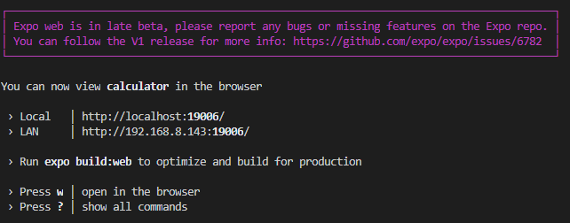
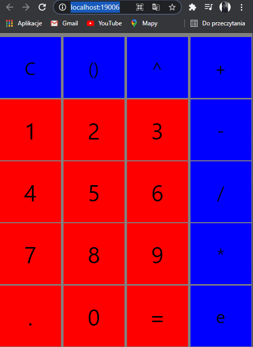
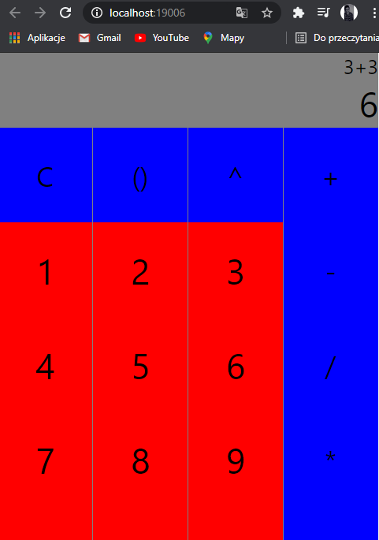
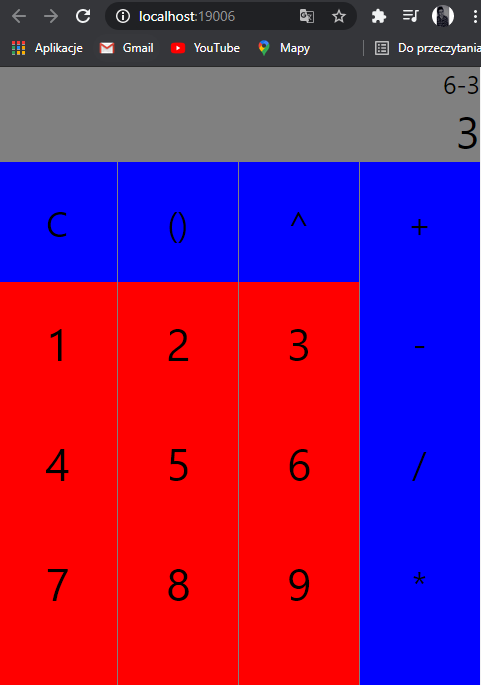
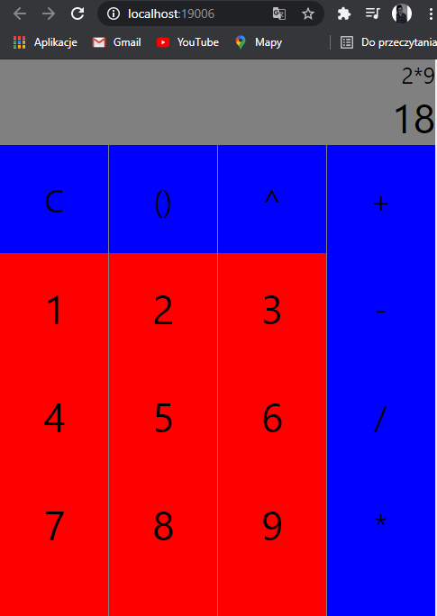
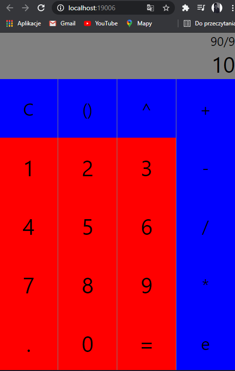
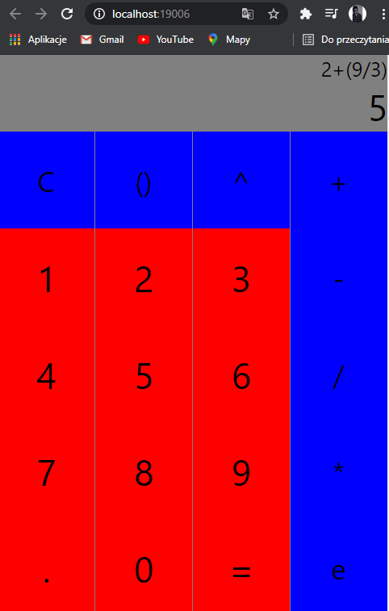

# Lab1 - Kalkulator

## Do wykonania Kalkulatora - React Native -> EXPO

## Potrzebne instalacje:

### npm install react-native-elements

### npm install metro-react-native-babel-preset

### npm install -g react-native-cli

## Włączanie aplikacji:

### expo start -> "w" - włącznie aplikacji w przeglądarce

# 

## Wygląd aplikacji:

# 

## Dodawanie:

# 

## Odejmowanie:

# 

## Mnożenie:

# 

## Dzielenie:

# 

## Działanie z nawiasem:

# 
