# Lab2 - Responsywne layouty + nawigacja

## Do wykonania Lab2 - React Native -> EXPO

## Utworzyłem 3 ekrany : Spread operator, rest parameters oraz hook useState. W każdym ekranie jest opcja do przejscia do pozostałych ekranów. Przycisk do cofnięcia w navigation do ekranu "home".

## Potrzebne instalacje:

### npm install @react-navigation/native

### npm install --save babel-runtime --save

### npm install react-navigation

### npm install @react-navigation/stack

### npm install react-native-gesture-handler

## Wygląd aplikacji + kod

## 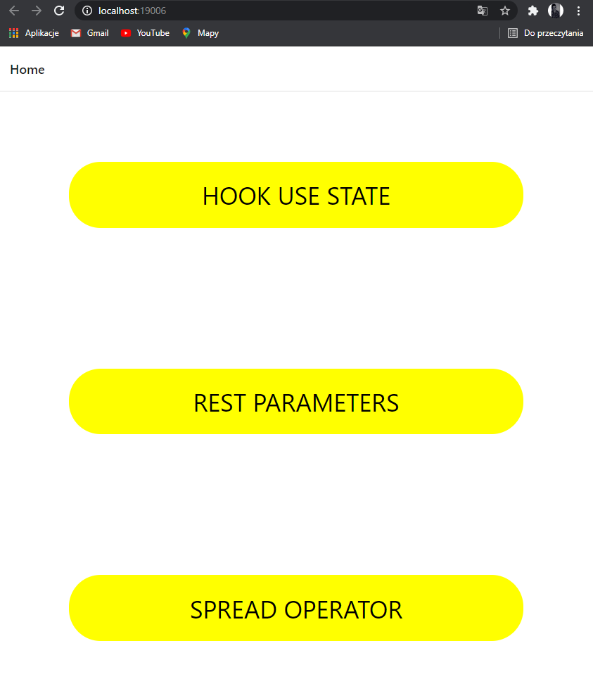

## 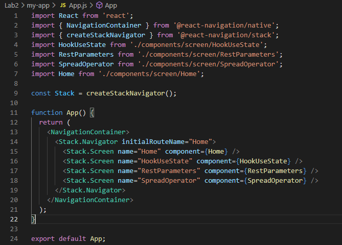

## 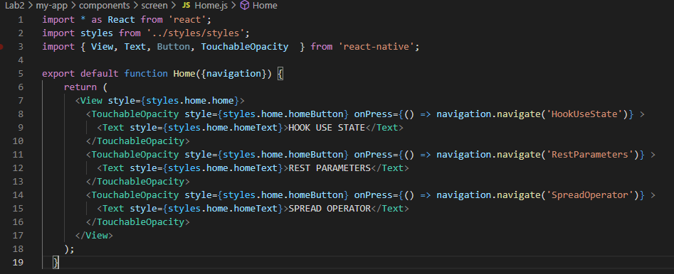

### styles.js

## 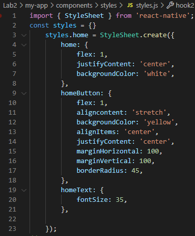

## Hook - use state

# 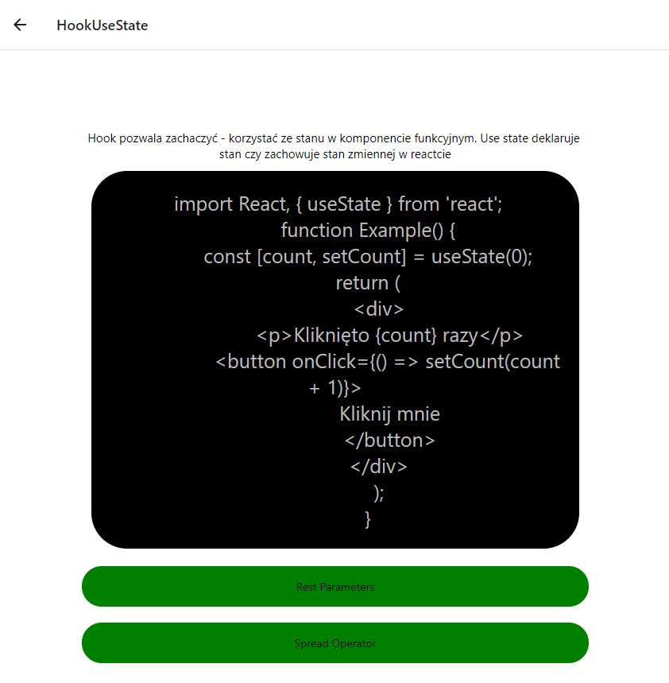

# 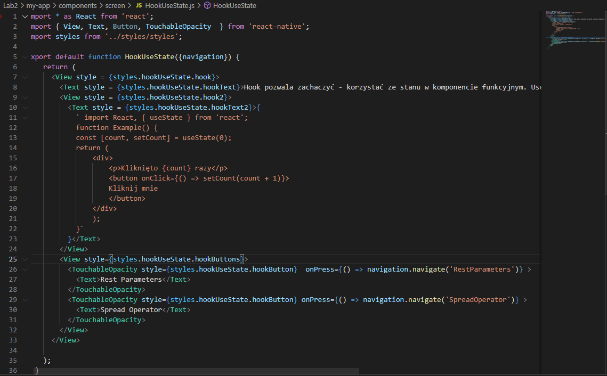

### styles.js

# 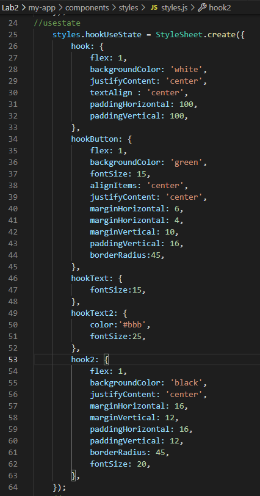

## Rest Parameters

# 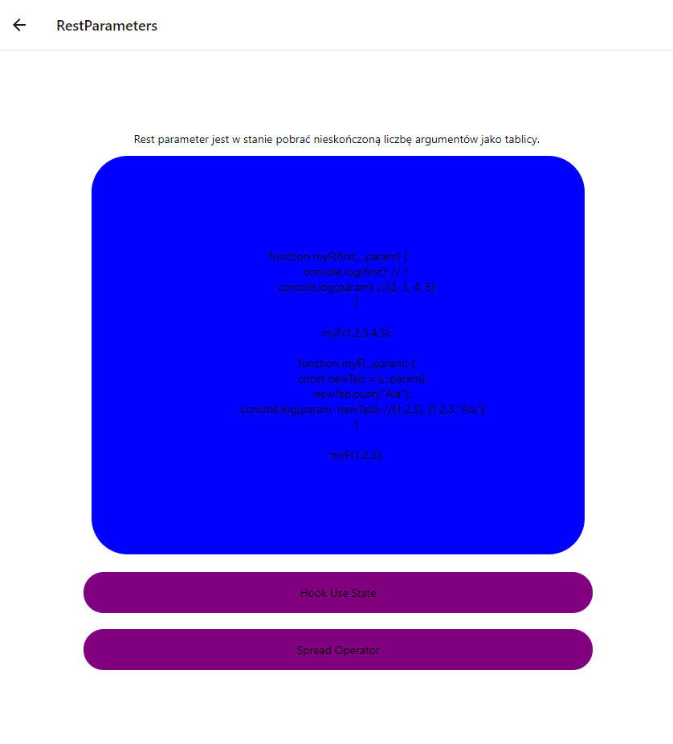

# 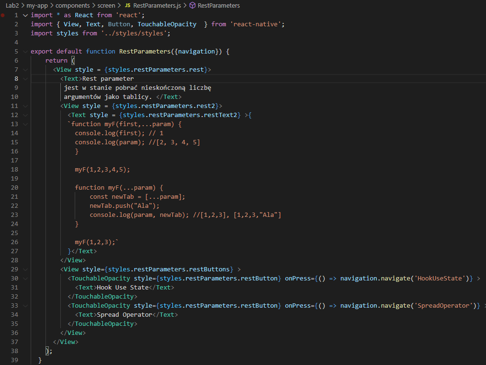

### styles.js

# 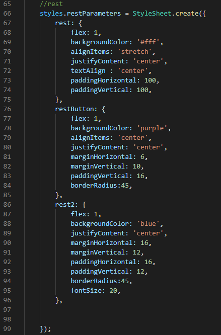

## Spread operator

# 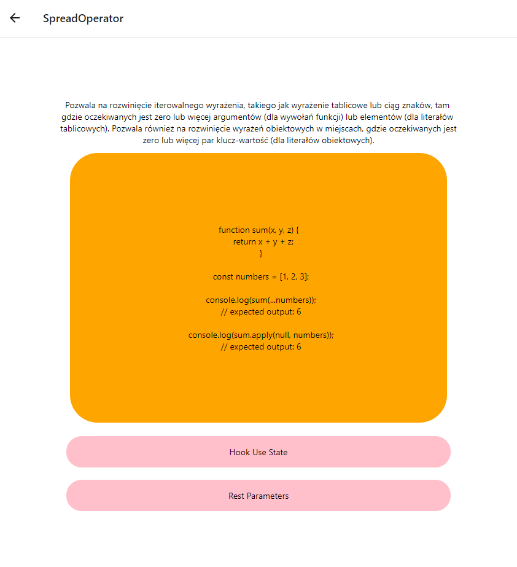

# 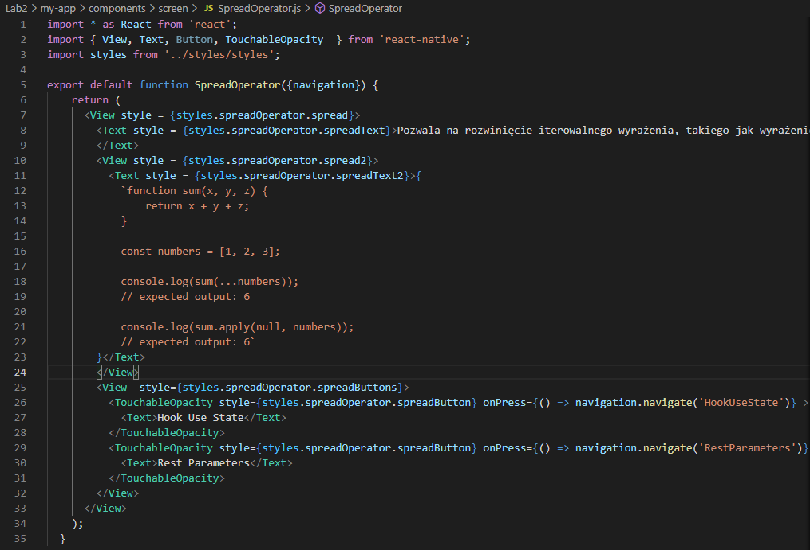

### styles.js

# 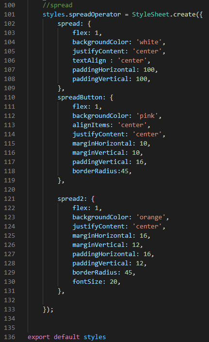
