# Lab3 - Renderowanie listy danych + obsługa progresu

## Do wykonania Lab3 renderowanie listy danych + obsługa progresu:

### 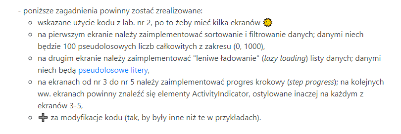

## Utworzyłem aplikacje z wyborem 3 ekranów. Do wyboru:

- Sortowanie i filtrowanie
- Lazy loading
- Step Progress

### Mozliwość przełączania się pomiędzy ekranami z załozeniami w opisie zadania

## Potrzebne instalacje:

### npm install @react-navigation/native

### npm install @react-navigation/stack

### npm i react-native-screens

### npm i react-native-tstyles

### npm install react-native-gesture-handler

## Strona startowa:

### 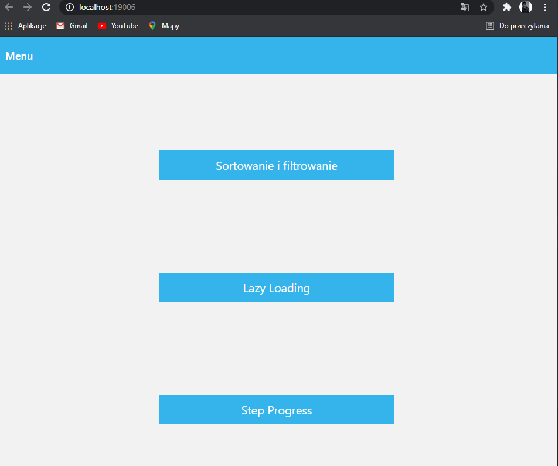

## Sortowanie i filtrowanie - wypisanie 100 liczb mniejszych od tysiąca

### 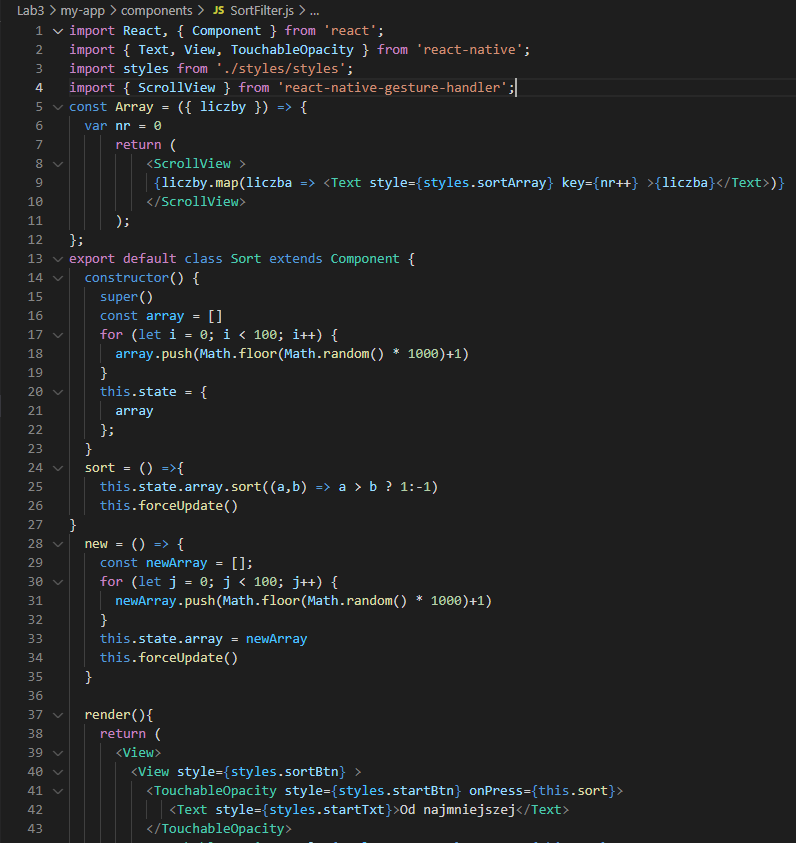

### 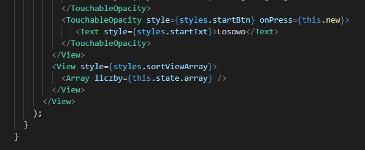

### 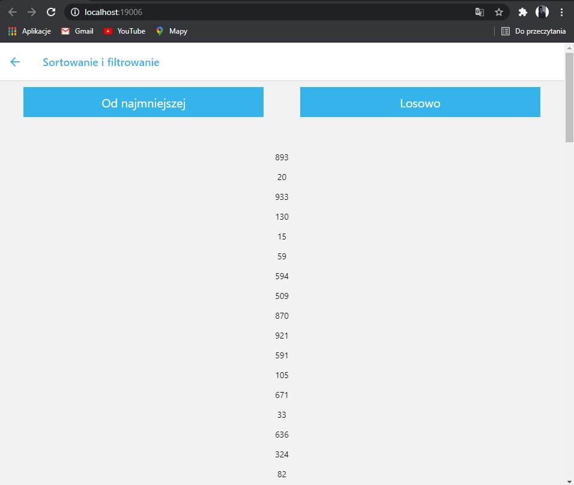

### Sotowowanie liczb od najmniejszego:

### 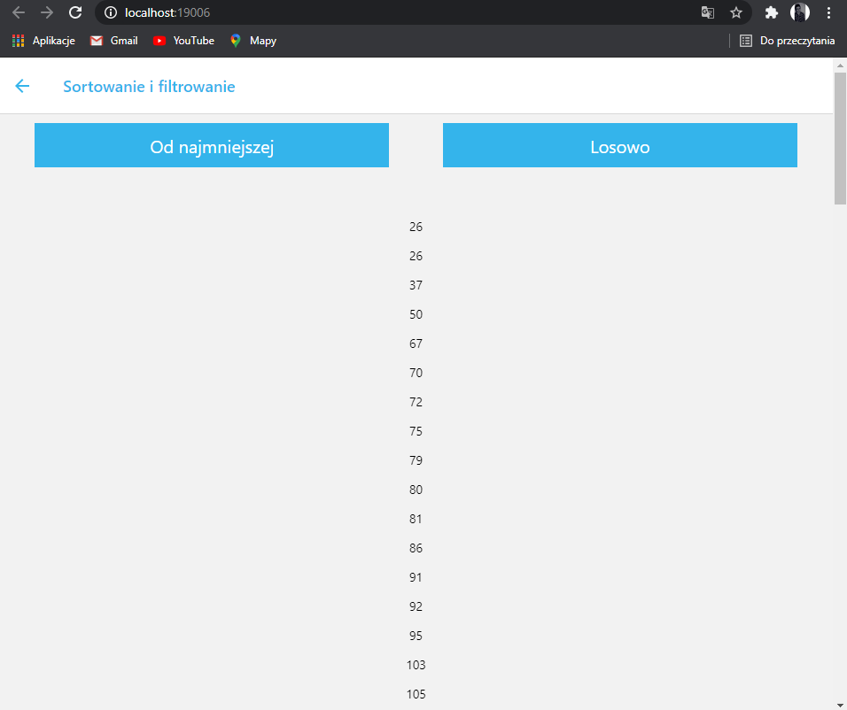

### Sortowanie liczb randomowo

### 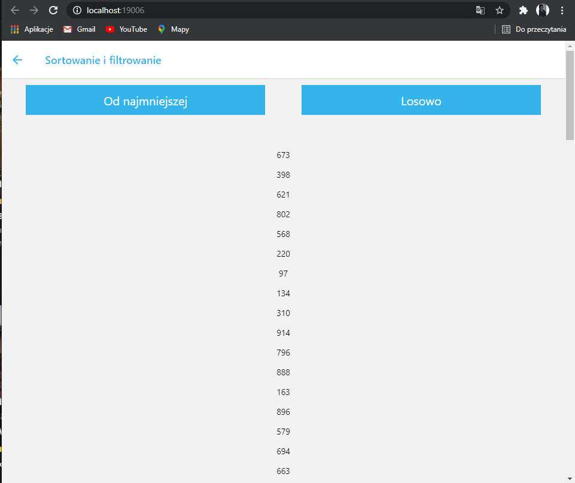

## Lazy Loading

### 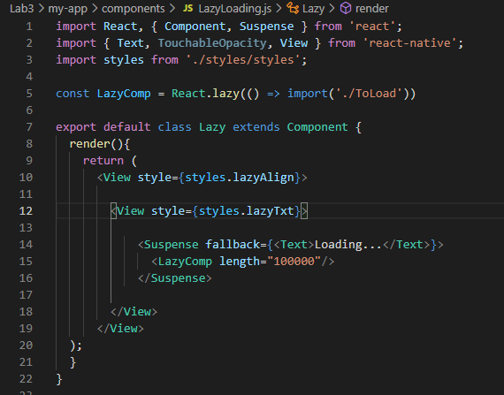

## Załadowanie pseudolosowych znaków metodoą lazy loading

## Funkcja dodająca znaki do tablicy

### 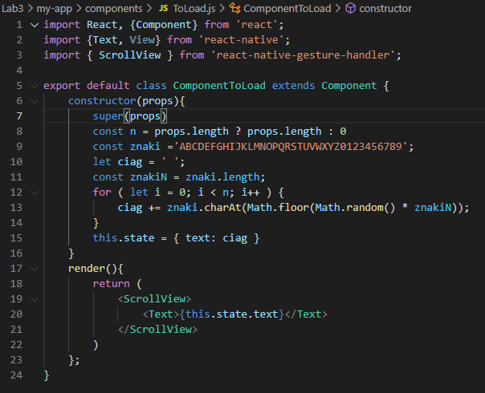

### 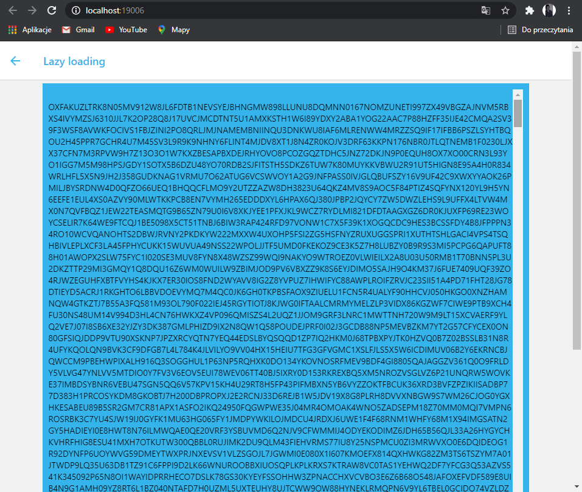

## Step progress

### 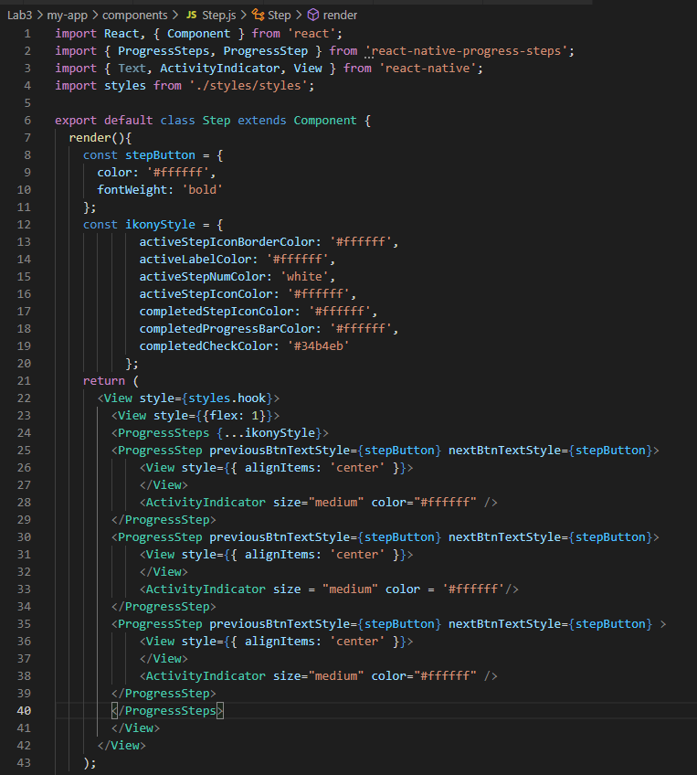

### 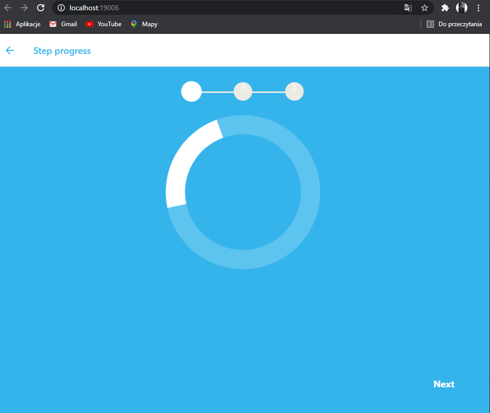

## Po przejsiu do następnej fazy ładoawnia, możemy powrócić do poprzedniej. Kołka zaznaczają się ikoną "tick"

### 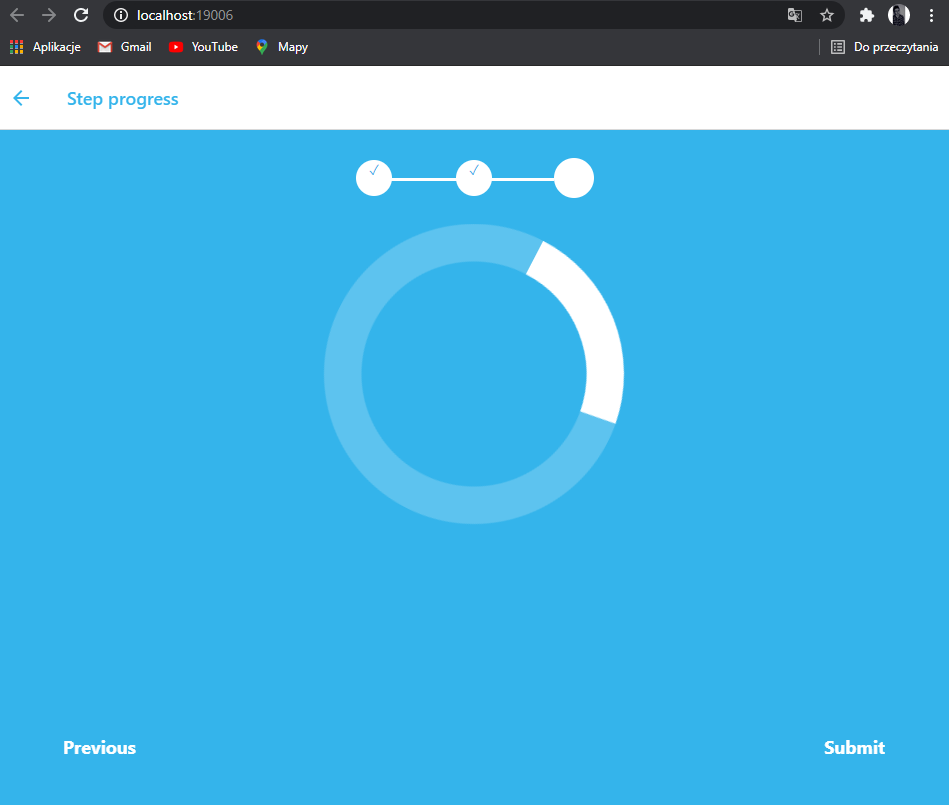
