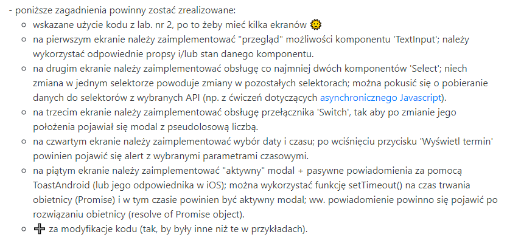
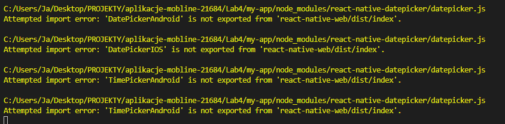

# Lab4 - obsługa danych wprowadzanych przez użytkownika + modale

## Do wykonania Lab4: :

### 

## Utworzyłem aplikacje z wyborem 5 ekranów. Do wyboru:

- Text Input
- Select i Picker
- Modal
- Date Picker
- Toast Android

## Dodatkowe instalacje

npm i react-native-datepicker

## Strona startowa:

### 

## Home.js

### 

## Text Input

### 

### Select i Picker

## Dla komedii

### 

## Dla filmu akcji

### 

### Modal

### 

## Po kliknięciu w suwak wybiera pseudolosową liczbę:

### 

## Wystąpił problem z importem datepickera, dlatego nie działają mi 2 ostatnie ekranty poprawnie. Spróbuje użyć innego datepickera -> @react-native-comunity/datetimepicker

### 

## Date Picker

### 

## Toase Android

### 
