# Lab5 - obsługa gestów użytkownika

## Do wykonania Lab5: :

### 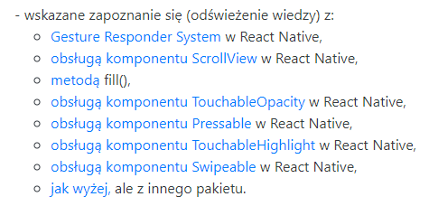

## Utworzyłem aplikacje z wyborem 5 ekranów. Do wyboru:

- ScrollView
- Touchable
- Swipeable

## Dodatkowe instalacje

### npm i react-native-swipeable

## Strona startowa:

### 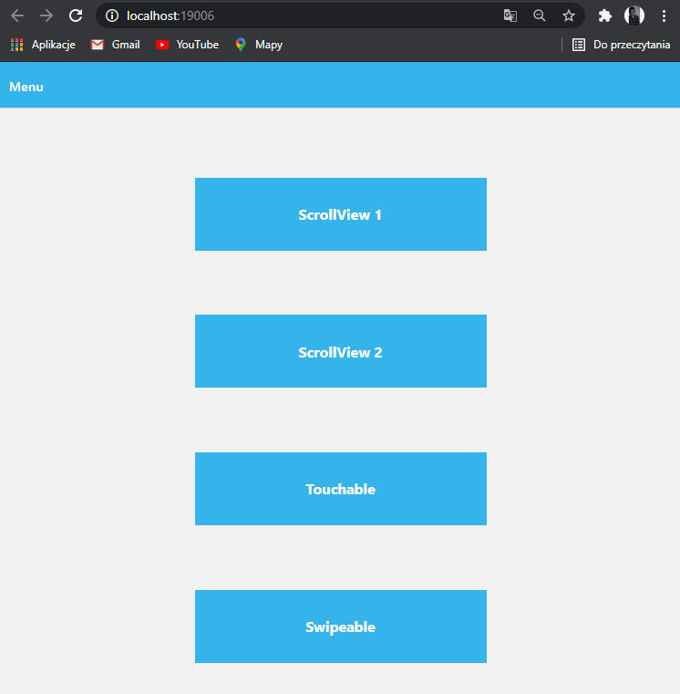

### Strona startowa - kod:

### 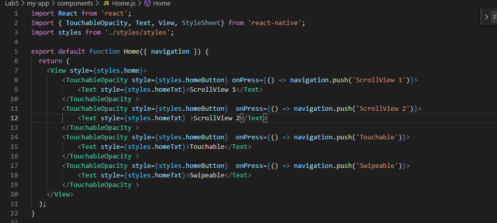

## Scroll View 1:

### 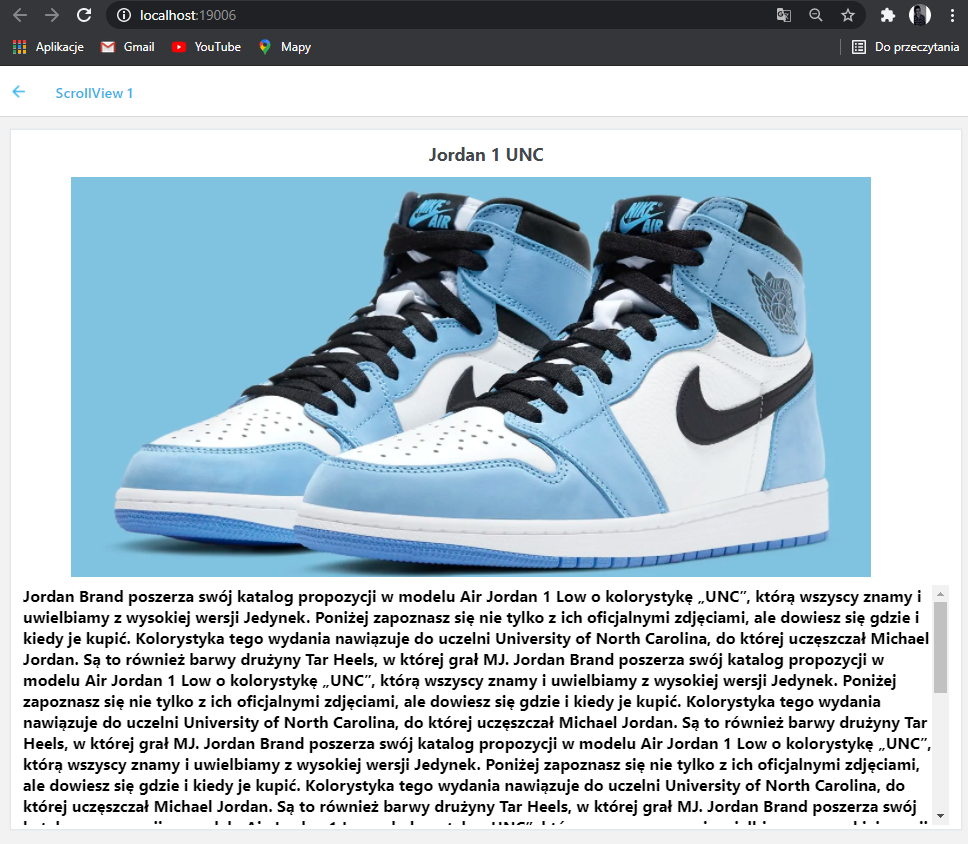

### Scroll View 1 - kod:

### 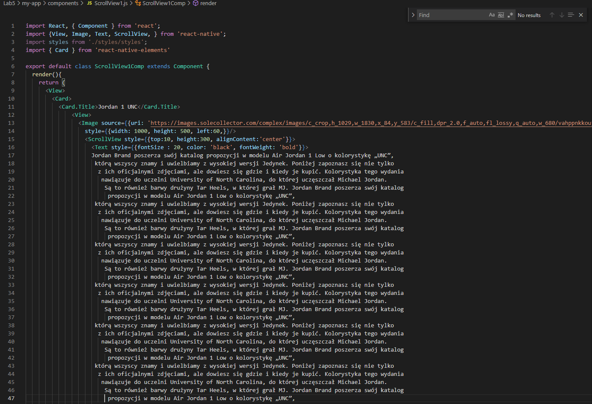

## Scroll View 2:

### 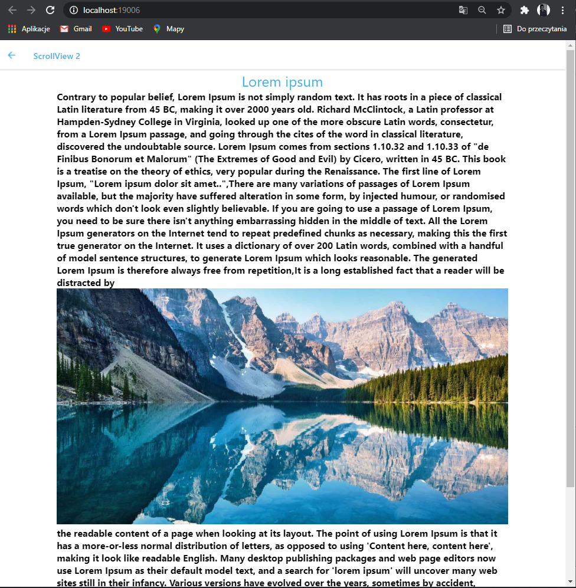

### Scroll View 2 - kod:

### 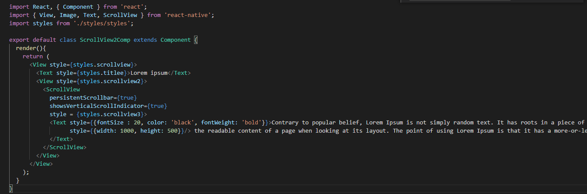

## Touchable:

### 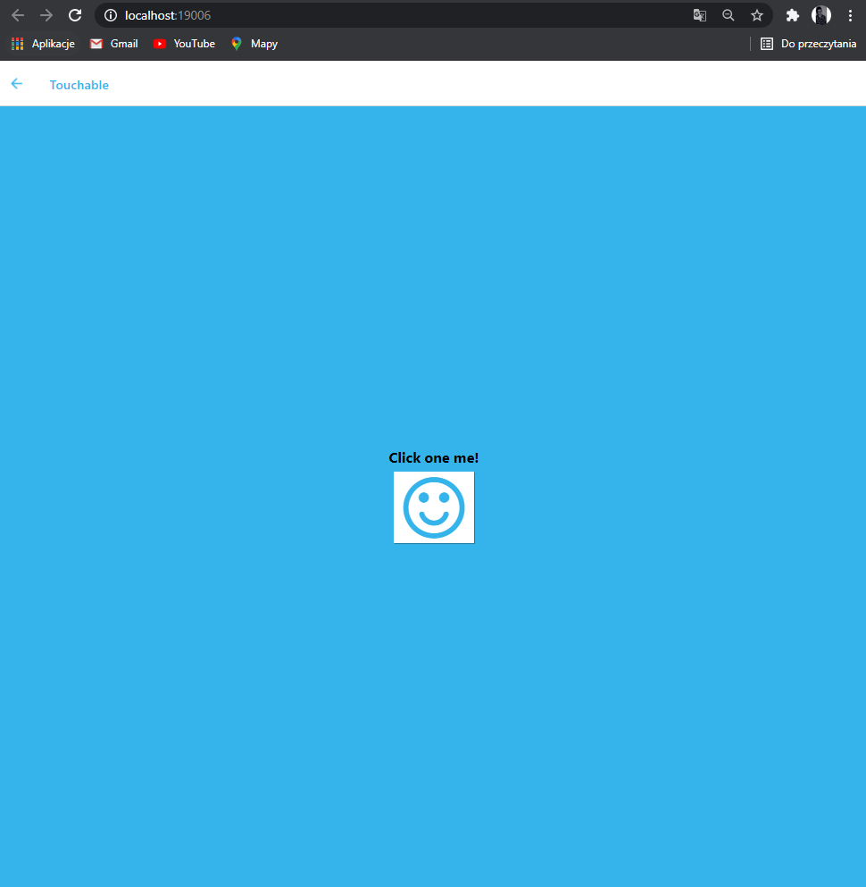

### Touchable on click

### 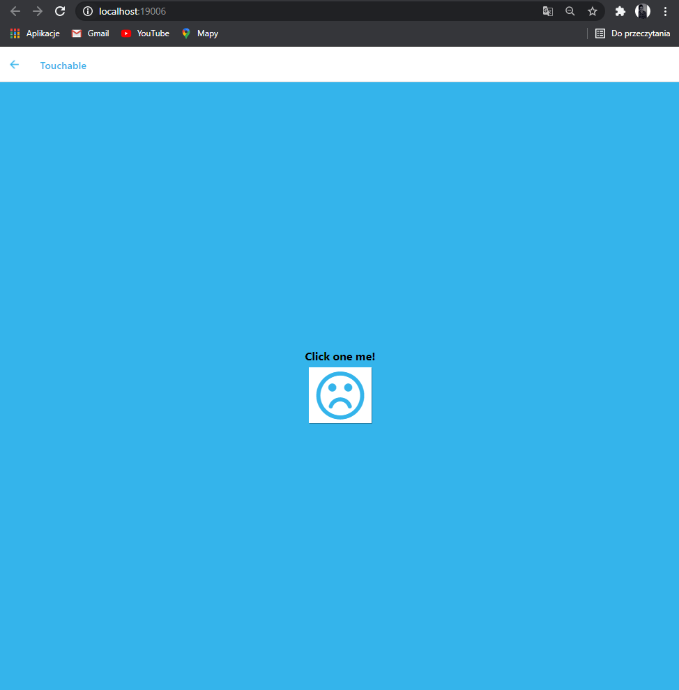

### Touchable - kod:

### 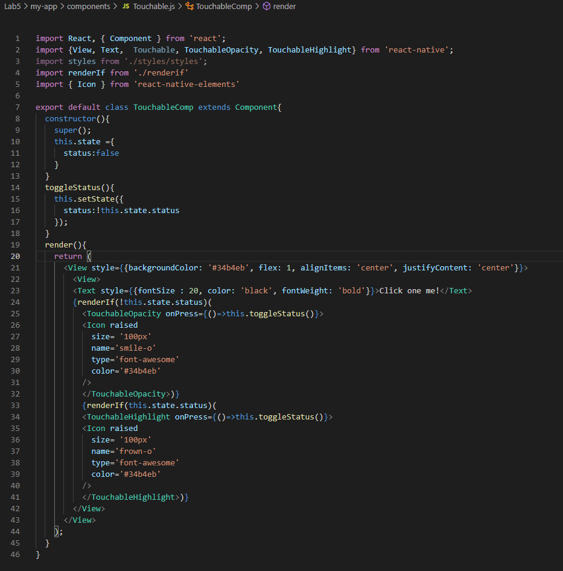

## Styles.css

### 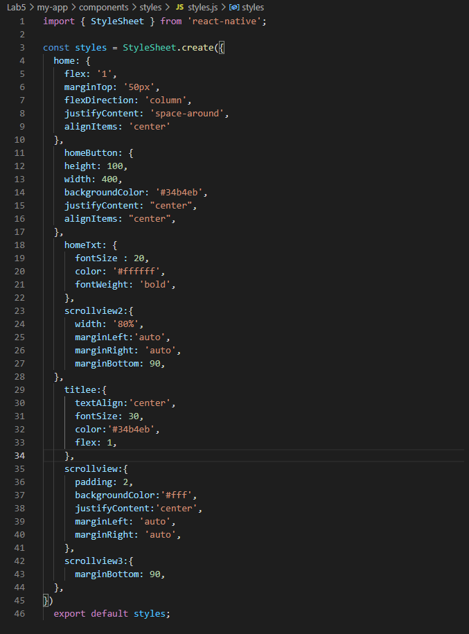
