# Lab6 - obsługa gestów użytkownika

## Do wykonania Lab6: :

### 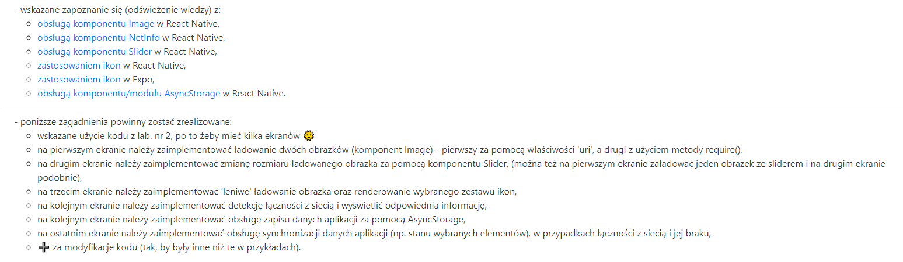

## Utworzyłem aplikacje z wyborem 6 ekranów. Do wyboru:

- Image
- Net Info
- Slider
- Lazy Icons
- Synch
- Async Storage

## Dodatkowe instalacje

expo install @react-native-async-storage/async-storage
npm install --save @react-native-community/netinfo
npm install @react-navigation/native
npm install react-navigation-stack
npm install react-native-elements
npm install react-native-screens

## Strona startowa:

### 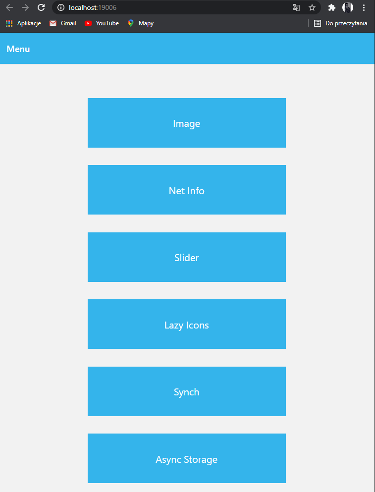

## Image - dwa obrazki. Jeden z urla, a drugi jako plik.

### 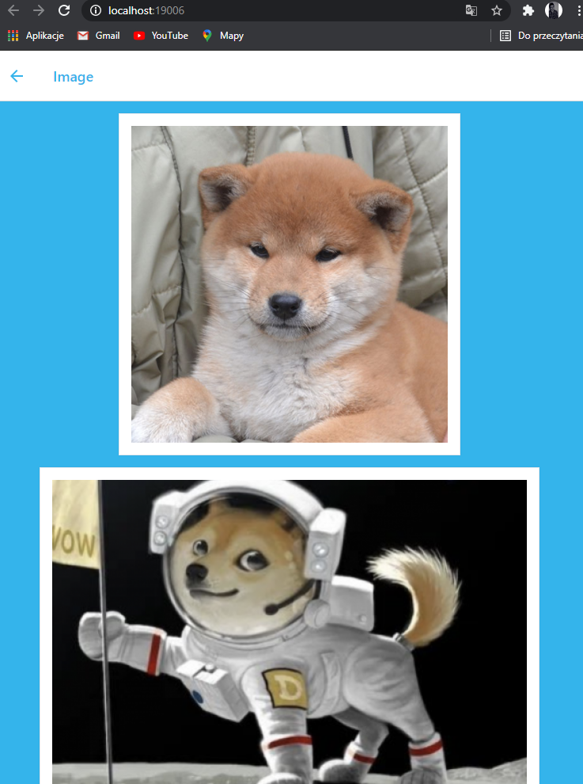

## NetInfo

### 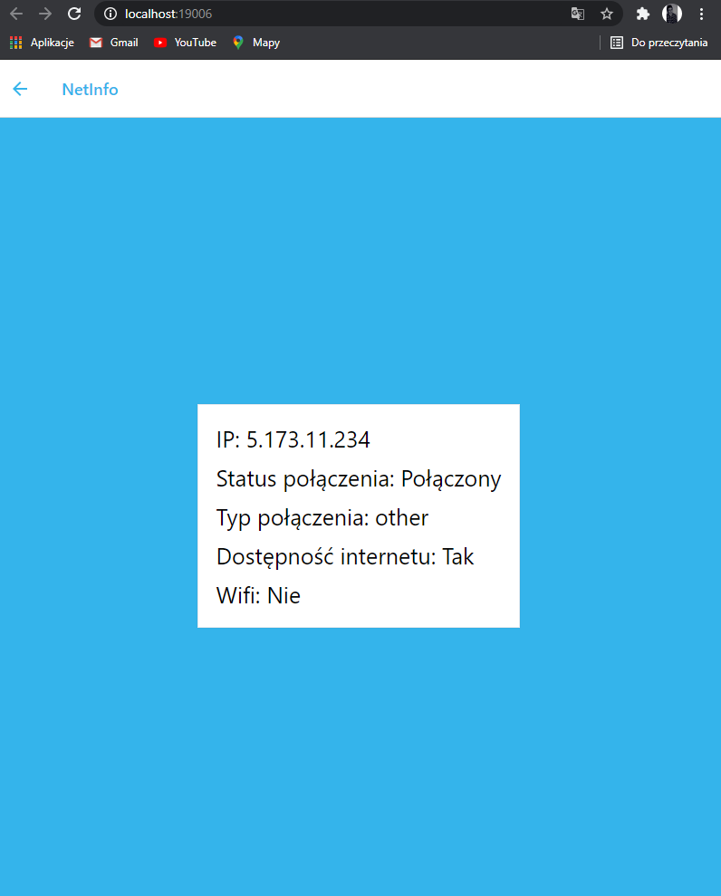

## Slider - możemy przybliżać i oddalać obrazek

### 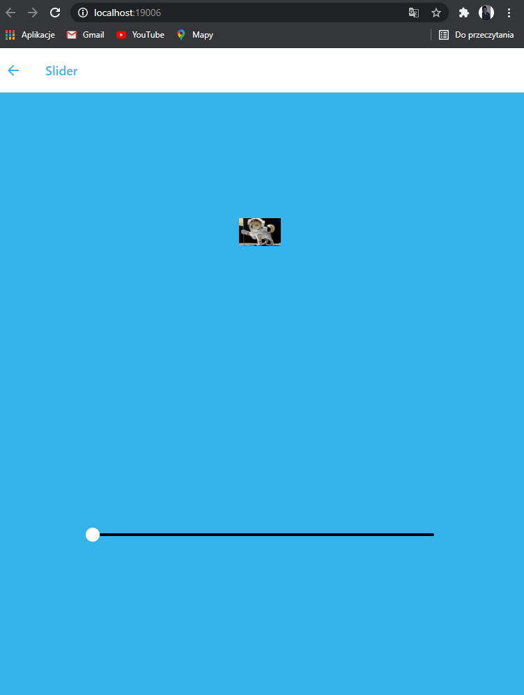

### 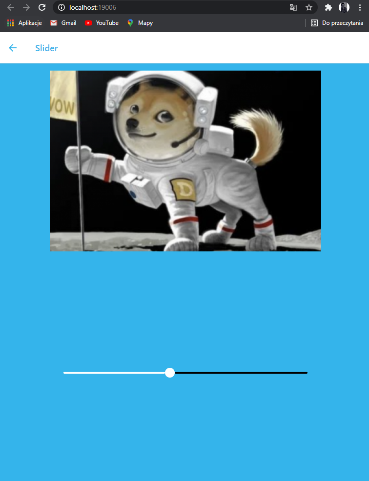

## Lazy Icons

### 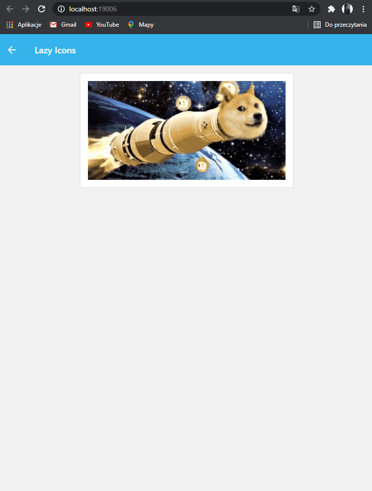

### 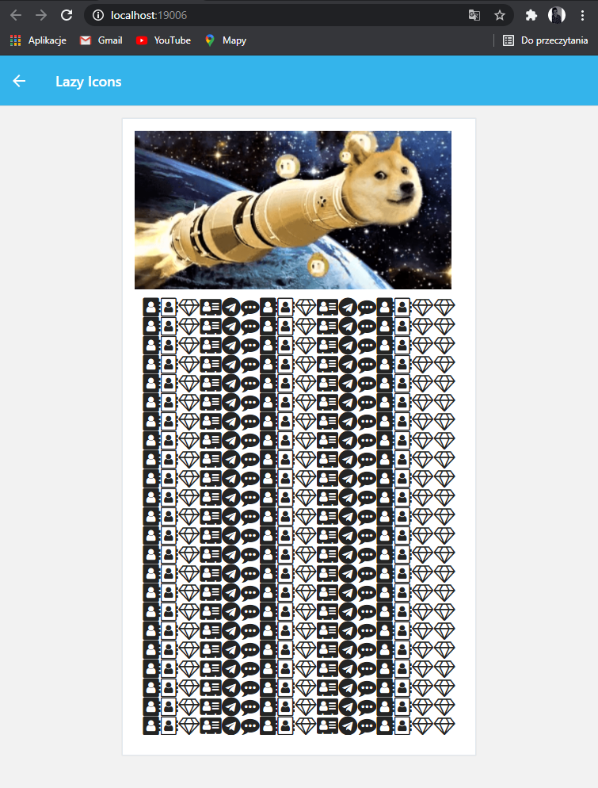

## Synchronizacja dancyh -

### 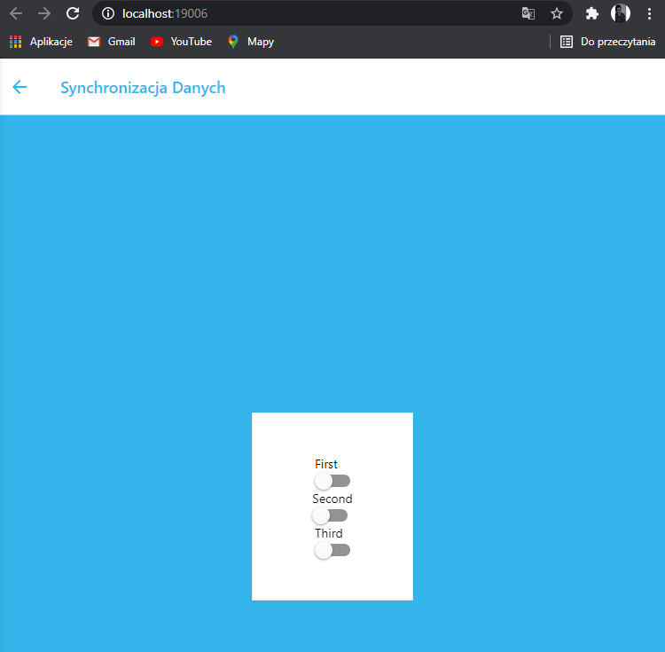

### 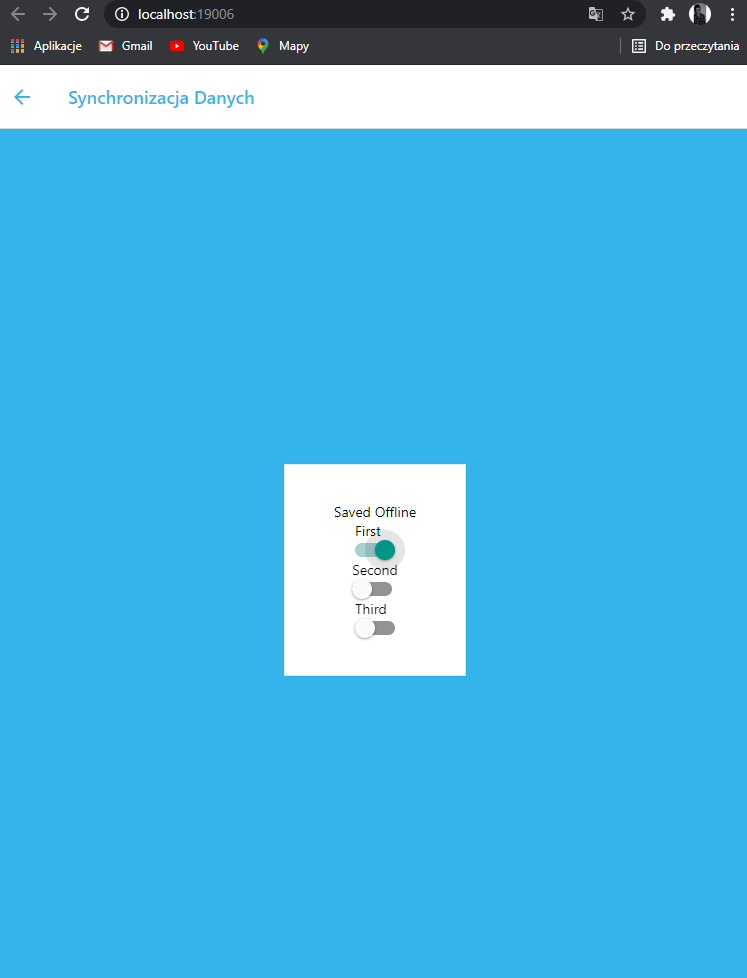

### 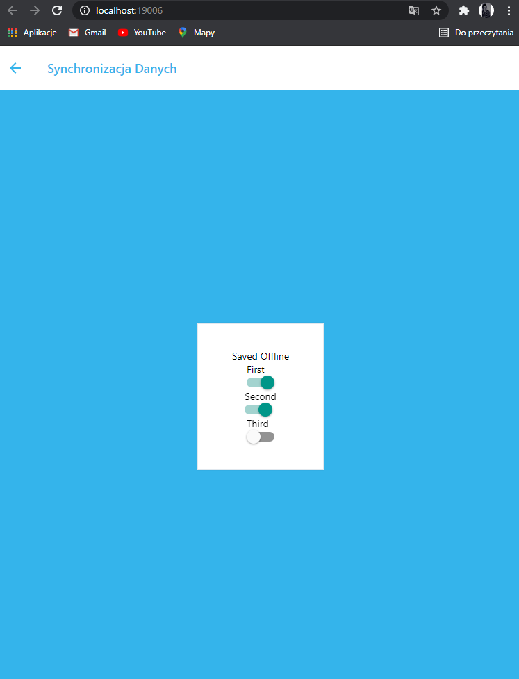

## Async Storage

### 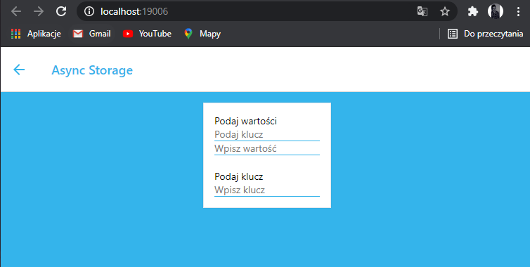

## Styles.js

### 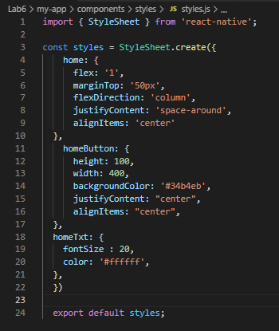
