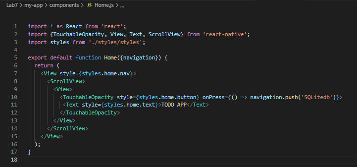
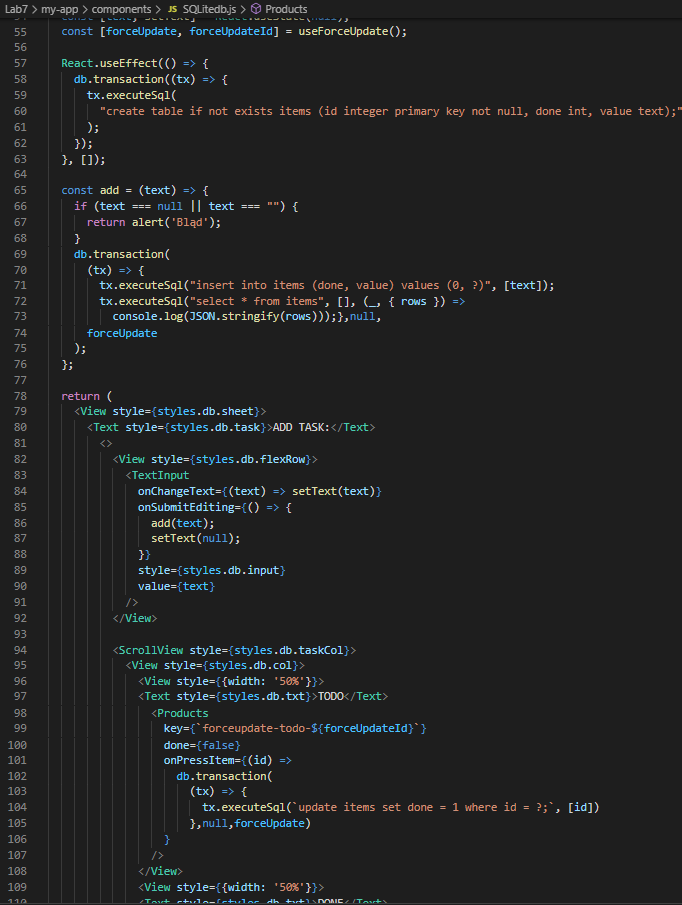
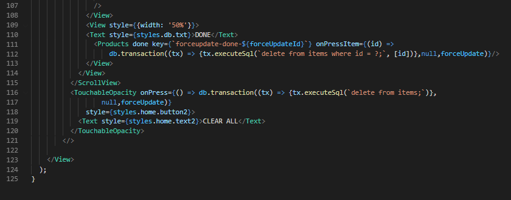
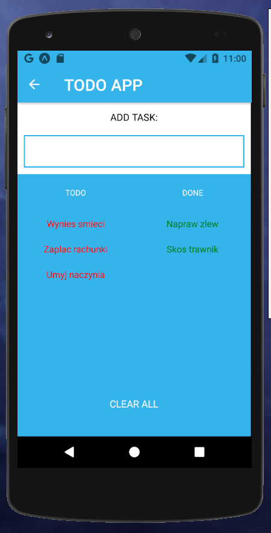
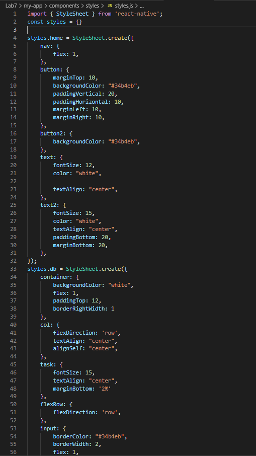

# Lab7 - SQLite

## Do wykonania Lab7: :

### 

## Utworzyłem prostą apkę TODO z wykorzystaniem SQLiteDB. Co ciekawe, SQLite nie działa w wersji przeglądarkowej z EXPO.

## Dodatkowe instalacje

expo install expo-sqlite
npm install @react-navigation/native
npm install react-navigation-stack

## Strona startowa:

### 

## App.js - kod:

### 

### Home - kod:

### 

## TODO APP:

### 

## SQLitedb.js kod:

### 

### 

### 

## Dodawanie zadań - po dodaniu automatycznie zadanie ląduje w tabeli "TODO". Po ponowym kliknięciu w czarwony napis zadania przeniesie je nam do "DONE". Jeżeli chcemy usunąć na raz wszystkie zadania - umożliwia nam to przycisk "CLEAR ALL"

### 

### 

## Widok z bd

### 

## styles.js

### 

### 
